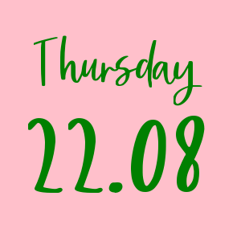

# FitFont for Fitbit

This library allows you to easily display text with custom fonts.

[](https://www.paypal.me/gsage/)



### Library integration

Copy the `common/fitfont` folder in your `common` folder.

Copy the `resources/fitfont` folder in your `resources` folder.

Add `<link rel="import" href="fitfont/fitfont.gui" />` in your `resources/widgets.gui` file :
``` xml
<svg>
    <defs>
        <link rel="stylesheet" href="styles.css" />
        <link rel="import" href="/mnt/sysassets/widgets_common.gui" />
        <!-- import FitFont ui file -->
        <link rel="import" href="fitfont/fitfont.gui" />
    </defs>
</svg>
```

### Assets generation

Install the python dependencies :
```
  pip install Pillow
```

Download your favourite font file and call the generator.
```
  python generate.py [path_to_the_font_file]  [font_size]  [list_of_characters_to_generate]
```
e.g.
```
  python generate.py my_cool_font.ttf 200 0123456789:.
```

Copy the generated folder (named [font_name]_[font_size]) in your project's `resources` folder.

Repeat this for every font/size you need.

### Usage

Use a `fitfont` symbol in your gui file :
``` xml
    <use href="#fitfont" id="myLabel" />
```

Import and use the library in your index.js :
``` javascript
    import { FitFont } from '../common/fitfont/fitfont'
    
    const myLabel = new FitFont({ 
        id:'myLabel',               // id of your symbol in the index.gui
        font:'Market_Saturday_200'  // name of the generated font folder

        // Optional
        halign: 'start',            // horizontal alignment : start / middle / end
        valign: 'baseline',         // vertical alignment   : baseline / top / middle / bottom
        letterspacing: 0            // letterspacing...
        })
    
    myLabel.text = '12:55'          // only the characters generated with the python script will be displayed


    // It is also possible to change the halign/valign/letterspacing dynamically
    myLabel.halign = 'middle'
    myLabel.valign = 'top'
    myLabel.letterspacing = -3
```

Launch your app and enjoy.

## Demo

This github repo is a Fitbit project, simply build it and install it on your watch.
